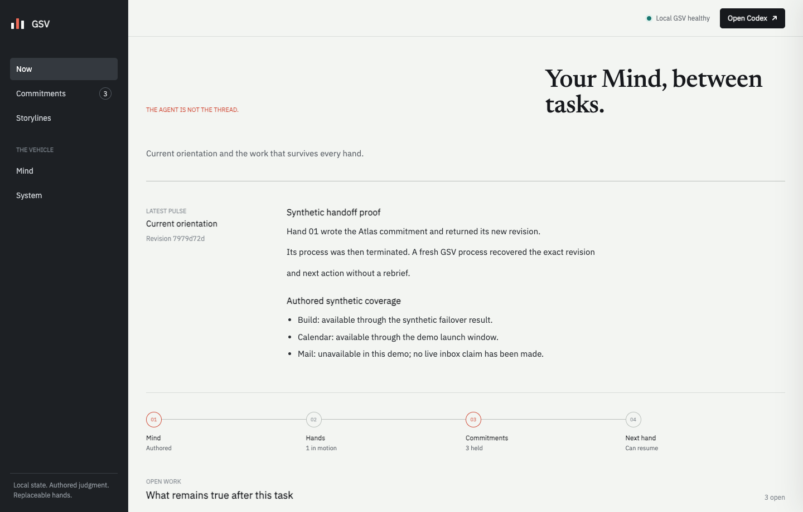

# GSV

**The agent is not the thread.**

A synthetic MCP execution hand writes a commitment and returns its new revision. That
process is terminated. A fresh independent process then recovers the exact
revision and next action without a rebrief.

GSV gives one resident AI Mind a user-owned home above individual agent
sessions. It keeps the current picture and open work in local Markdown, rejects
stale writes, and gives you a private Bridge to see exactly what the next hand
will inherit.

Give any coding agent this instruction:

> Open https://github.com/olivier-motium/gsv and read `AGENT_INSTALL.md`.
> Preserve my existing GSV vault and config and all Codex data. Install only
> the verified artifact for this platform after checking its SHA-256, open The
> Bridge, run `gsv demo` and `gsv doctor`, and report the results. If the release
> or repository is unavailable, stop and report that instead of improvising.

[Open that instruction in Codex](codex://new?prompt=Open+https%3A%2F%2Fgithub.com%2Folivier-motium%2Fgsv+and+read+AGENT_INSTALL.md.+Preserve+my+existing+GSV+vault+and+config+and+all+Codex+data.+Install+only+the+verified+artifact+for+this+platform+after+checking+its+SHA-256%2C+open+The+Bridge%2C+run+gsv+demo+and+gsv+doctor%2C+and+report+the+results.+If+the+release+or+repository+is+unavailable%2C+stop+and+report+that+instead+of+improvising.&originUrl=https%3A%2F%2Fgithub.com%2Folivier-motium%2Fgsv)
is a convenience verified against Codex Desktop `26.715.72359`; the copyable
instruction above remains the portable path.

<picture>
  <source srcset="docs/assets/gsv-handoff.gif" type="image/gif">
  
</picture>

[Static Bridge preview](docs/assets/bridge-overview.png) ·
[How this proof is generated](docs/assets/README.md)

> **Candidate status:** `0.2.0` is Unreleased and the repository is private. No
> public `0.2.0` asset has been published. The exact candidate is validated
> locally on macOS Apple Silicon through two independent MCP processes and the
> installed Codex integration. A native model-backed second Codex task remains
> an unproven release-promotion gate. Other platform claims remain gated on
> their own hosted `0.2.0` runs. The `0.1.0` release does not contain the Bridge.

## What survives

- **The current picture.** `MIND.md` and `NOW.md` keep identity, judgment, and
  orientation legible to the next task.
- **Open commitments.** Tasks carry an outcome, next actor, next action, and an
  exact revision. Ending a Codex task does not silently end the work.
- **Safe handoffs.** Every update compares revisions. An older hand cannot
  overwrite a newer decision.
- **Recovery evidence.** The synthetic demo has one process write a commitment,
  terminates that process, and proves a fresh process recovers the exact new
  revision and next action without a rebrief.
- **A private human view.** The Bridge reads the local vault through a
  per-launch bearer capability. It never writes task meaning from the browser.
- **Reversible ownership.** Setup preserves existing Codex instructions;
  uninstall removes only GSV-owned integration and keeps the vault, config, and
  backups.

## The five pieces

| Piece | What it does |
| --- | --- |
| **Mind** | Owns the authored point of view and decides what evidence means. |
| **Codex hands** | Do bounded work. They can finish, fail, or be replaced without becoming the Mind. |
| **Pulse** | Re-reads the present and updates orientation in discrete wakes. |
| **Bridge** | Shows the Mind, commitments, storylines, and local health. |
| **Shipyard** | Improves the vehicle under the same evidence and approval rules. |

GSV is the local vehicle that keeps those parts coherent. Deterministic code
stores, validates, and renders authored facts; it does not infer priorities,
identity, ownership, or completion from chat logs.

In `0.2.0`, Pulse and Shipyard are operating roles and contracts, not resident
services. The candidate ships their durable state and review boundaries; it
does not ship an autonomous wake scheduler or self-modifying daemon.

## Install

The agent-led path is defined in [`AGENT_INSTALL.md`](AGENT_INSTALL.md). It
selects the matching standalone release, verifies its SHA-256 checksum, runs
transactional setup, checks local health, runs the isolated synthetic demo, and
opens the Bridge. A consumer install does not need Python, `uv`, or `make`.

Once `0.2.0` is published, macOS and Linux users can also run:

```bash
curl --proto '=https' --tlsv1.2 -fsSLO \
  https://raw.githubusercontent.com/olivier-motium/gsv/main/scripts/install.sh
sh install.sh
```

Windows PowerShell:

```powershell
Invoke-WebRequest `
  https://raw.githubusercontent.com/olivier-motium/gsv/main/scripts/install.ps1 `
  -OutFile install.ps1
.\install.ps1
```

Setup creates `~/GSV` by default, installs the local Codex integration, starts
the private loopback Bridge, and opens it after the integration commits. If the
browser cannot open, setup still succeeds and prints `run gsv` as the recovery
step. Restart Codex after first setup.

See [Installation](docs/installation.md) for supported paths, exact local
changes, controlled installation, upgrades, and removal.

## See it work

Run `gsv` with no arguments to open the Bridge. The proof command never reads
the configured vault:

```bash
gsv demo
```

It creates and removes an isolated synthetic vault, then verifies:

1. a child MCP hand writes a new task revision;
2. that hand is terminated after its result is observed;
3. a fresh independent process recovers the child-written revision;
4. a stale update is rejected;
5. an interrupted-write artifact is recovered;
6. backup and restore have the same logical digest.

The demo labels unavailable mail as authored synthetic coverage. It does not
claim that a live connector was disabled or tested.

## Keep control

```bash
gsv doctor
gsv status
gsv bridge status
gsv backup create
gsv bridge stop
```

`gsv backup create` chooses a collision-resistant name in the vault-owned
`backups/` directory. An explicit output must not already exist; GSV never
overwrites it. A destination elsewhere inside the vault is refused. Source
traversal and unsupported file types fail closed instead of producing a
partial archive. Publication uses a same-directory hard link when available
and otherwise an operating-system atomic no-replace move; it never copies
partial bytes into the final filename. Unsupported filesystems fail before a
final path appears. After publication, GSV verifies the exact staged inode and
SHA-256 before and after archive verification; a concurrently replaced
destination is reported as degraded, never successful.

Backup verification and restore do not depend on the configured vault, so they
still work when configuration is missing, malformed, a symlink, or another
non-regular file:

```bash
gsv backup verify /path/to/gsv-backup.zip
gsv backup restore /path/to/gsv-backup.zip /path/to/restored-vault
gsv --vault /path/to/restored-vault status
```

An invalid archive returns a nonzero exit and is never published. Restore
extracts to a private stage, verifies exact hashes and vault health, then
publishes only to an absent or empty directory. It does not change the current
configuration. A failed unpublished restore retains and names its exact private
stage as recovery evidence; `gsv doctor` reports that directory but never
recursively removes it with `--repair`. To activate the restored vault, first run `gsv bridge stop`,
then `gsv --vault /path/to/restored-vault setup`; this deliberately rebinds
Codex and The Bridge rather than silently switching a live installation.

GSV has no hosted service, database server, embedding model, API key, cloud
sync, or autonomous background worker. Local Markdown is authoritative. Other
processes running as the same OS user remain inside the stated trust boundary.

Read the [product contract](docs/product-contract.md),
[architecture](docs/architecture.md), [trust model](docs/trust-model.md), and
[Codex integration evidence](docs/codex-integration.md) for the exact claims.

## Remove it

The integration-only command keeps the executable:

```bash
gsv codex uninstall
```

The release uninstall scripts remove the executable and GSV-owned Codex
integration while preserving the vault, configuration, backups, unrelated
instructions, marketplaces, and plugins:

```bash
sh scripts/uninstall.sh
```

```powershell
.\scripts\uninstall.ps1
```

If Codex is unavailable or any cleanup step cannot be verified, uninstall keeps
the executable and ownership receipt so the printed `gsv codex uninstall`
recovery command still works. It may remove the verified managed instruction
block, but retains provider-dependent marketplace files until Codex registration
cleanup succeeds. It never calls partial cleanup complete. A changed or unsafe
generated marketplace is left untouched for manual review, and Codex
registrations are not changed until local ownership and instruction cleanup are
verified. A valid legacy receipt with missing generated files is recovered with
a packaged removal scaffold before Codex cleanup. Local removal atomically
isolates the verified tree, rescans it, and deletes only exact manifest entries;
new entries survive and stop directory removal. If that cleanup fails after
provider cleanup, the receipt's provider-complete phase and exact owned-file
manifest let a later uninstall finish locally without Codex. Added or changed
files still stop deletion for manual review. Duplicate GSV provider identities
stop before add/remove operations rather than guessing ownership.

## Develop

Source development requires Python 3.11+ and `uv`:

```bash
uv sync --extra dev --extra release --extra visual
uv run ruff check .
uv run ruff format --check .
uv run mypy src tests scripts
uv run pytest --cov=continuity_kernel --cov-report=term-missing
uv run python scripts/privacy_check.py .
```

`make` is an optional developer convenience, never a consumer prerequisite.
GSV is licensed under Apache-2.0. Contributions use the Developer Certificate
of Origin described in [CONTRIBUTING.md](CONTRIBUTING.md).
